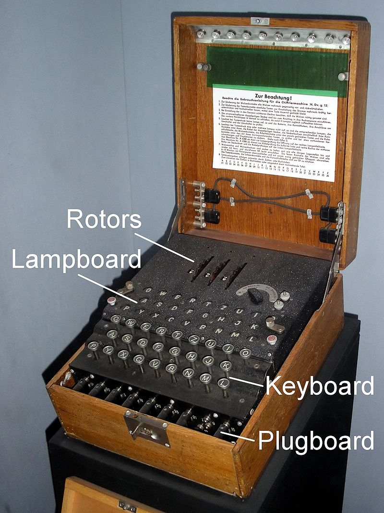

# Practical Scripting with Python

### Cryptography
Today we will be looking at Cryptography which is the art of making messages unreadable except by people who know the method of decrypting the secret message. There are many types of ciphers used historically and by people on the internet today.

We are going to start with the historical ciphers first.

### Caesar Cipher
The Caesar cipher is named after Julius Caesar, who, according to Suetonius, used it with a shift of three (A becoming D when encrypting, and D becoming A when decrypting) to protect messages of military significance. While Caesar's was the first recorded use of this scheme, other substitution ciphers are known to have been used earlier.
[Code.org Caesar Cipher](https://studio.code.org/s/csp4-2019/stage/7/puzzle/2)

#### CaesarCipher.py
The program has the ability to encode a message. It does this by going through each letter in the message, finding that letter's location in the alphabet. Then the **key** value is added to the letter location. The letter of the new location is returned. If the letter is beyond the bounds of the alphabet, then it wraps around the front ***(Z + 2 = B)***.

We are going to try to write the decode function.

### Vigenère Cipher

The Vigenère cipher is similar to the Caesar cipher but the key shifts between each letter.  This makes frequency analysis more difficult since the same letter in plaintext could be different letters in the cipher text.

A keyword is used to give us the shifts. For example if the keyword were "KEY" then we would do a caesar shift of [10, 4, 24] that would be repeated for the duration of the message.
[Code.org Vigenere Cipher](https://studio.code.org/s/csp4-2019/stage/8/puzzle/2)

#### VigenereCipher.py
We will need to use the previous Caesar Cipher to complete the Vigenère Cipher.

### Substitution Cipher
In a substitution cipher, the normal alphabet is substituted with a 1:1 mapping of a scrambled alphabet. This type of encryption can be attacked based on a frequency analysis to determine the original letters based on their frequency in the encrypted message vs. the frequency in the English language.
- [Code.org Substitution Cipher](https://studio.code.org/s/csp4-2019/stage/7/puzzle/5)
- [NSA Crypto Challenge](https://cryptochallenge.io/)

#### SubstitutionCipher.py
This has several functions to generate a "key". We will explore how we could utilize each of them.

### Enigma Machine
The Enigma machine is an encryption device developed and used in the early- to mid-20th century to protect commercial, diplomatic and military communication. It was employed extensively by Nazi Germany during World War II, in all branches of the German military.

#### Enigma.py
We will look at how the Enigma Machine worked and try to add new rotors.
[Enigma rotor details](https://en.wikipedia.org/wiki/Enigma_rotor_details)

### More Ciphers in Python
https://inventwithpython.com/cracking/
